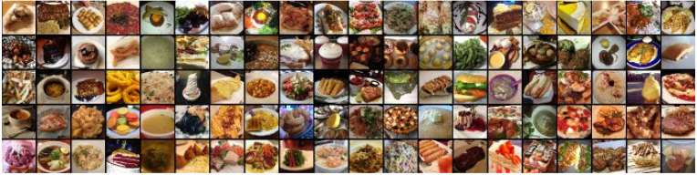

# Multiclass Classification of different types of food.
A linear SVM is trained to perform classification on randomly 3 subsets of 10 and 2 subsets of
30 classes by using the responses from the final fully connected layer as features from VGG-16 and ResNet-34 models. After training, the top 5 classes with highest classification accuracy and the 5 worst performing classes are reported.
 

## Dataset
The Food-101 dataset consists of 101 food categories with 750 training and 250 test images per category, making a total of 101k images.
You can download the dataset from here
[Food-101](https://www.kaggle.com/dansbecker/food-101)

